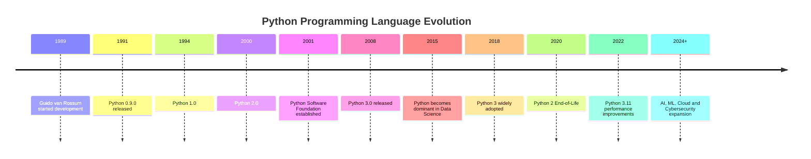
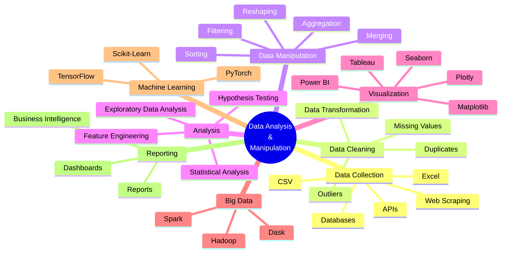
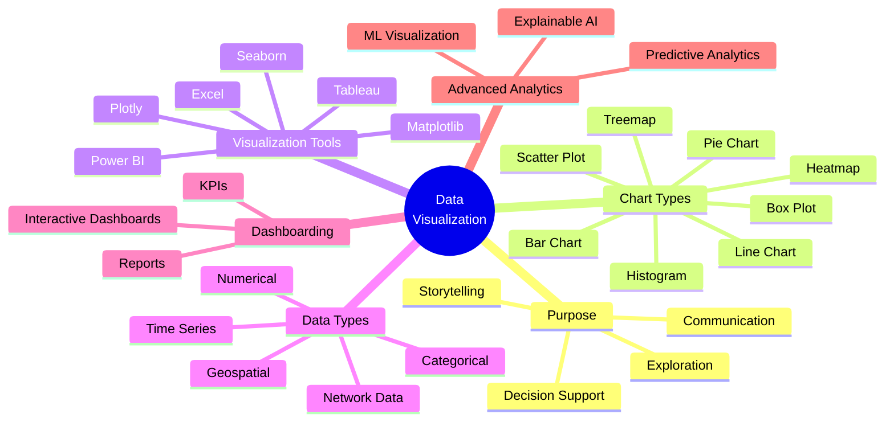
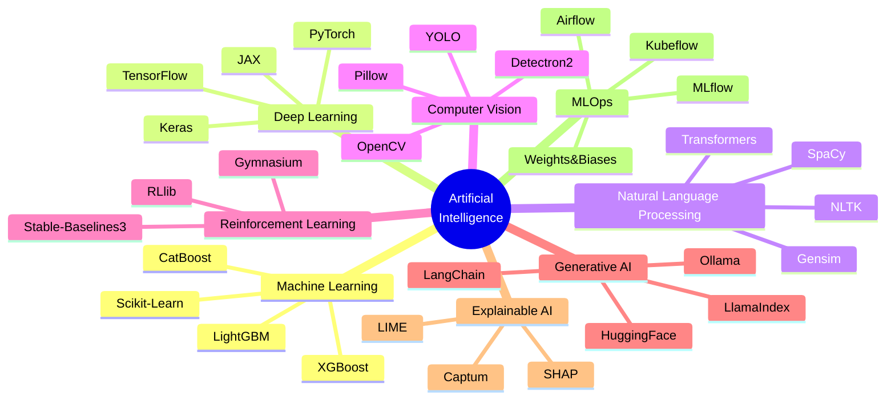
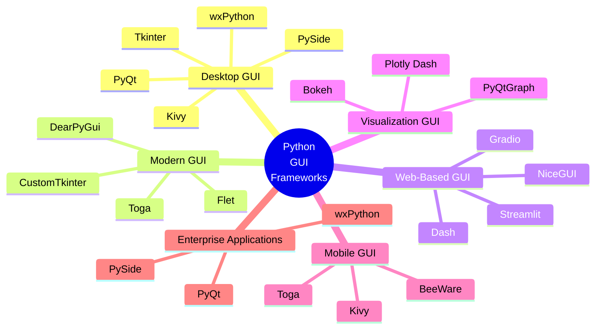

    

        
    

# **`Awesome`** [Python](https://www.python.org/) Programming Language 

    
    &nbsp;
    
    &nbsp;
    
    

## 📖 Contents
- [Library](#library)
    - [Data Analysis and Manipulation](#1-data-analysis-and-manipulation)
    - [Data Visualization](#2-data-visualization)
    - [Artificial Intelligence](#3-artificial-intelligence)
        - [AutoML](#automl)
    - [GUI Development](#4-gui-development)
    - [Miscellaneous](#5-miscellaneous)
- [My Other Awesome Lists](#my-other-awesome-lists)
- [Contributing](#contributing)
- [Contributors](#contributors)

## Library

### 1. Data Analysis and Manipulation

- [Pandas](https://pandas.pydata.org/)
- [Numpy](https://numpy.org/)

### 2. Data Visualization

- [Matplotlib](https://matplotlib.org/)
- [Plotly](https://plotly.com/python/)
- [Seaborn](https://seaborn.pydata.org/)

### 3. Artificial Intelligence

- [Keras](https://github.com/keras-team/keras) - Deep [Learning](https://keras.io/) for humans
- [PyTorch](https://github.com/pytorch/pytorch) - Tensors and Dynamic [neural networks](https://pytorch.org/) in Python with strong GPU acceleration.
- [Scikit-learn](https://github.com/scikit-learn/scikit-learn) - [Scikit-learn](https://scikit-learn.org/stable/) is an open-source Python library widely used for machine learning.
- [TensorFlow](https://github.com/tensorflow/tensorflow) - An Open Source [Machine Learning Framework](https://www.tensorflow.org/) for Everyone.
- [XGBoost](https://github.com/dmlc/xgboost) - [XGBoost](https://xgboost.readthedocs.io/en/stable/) is an optimized distributed gradient boosting library designed to be highly efficient, flexible and portable.
#### AutoML
- [AutoKeras](https://github.com/keras-team/autokeras) - [AutoKeras](https://autokeras.com/): An AutoML system based on Keras.
- [Auto-PyTorch](https://github.com/automl/Auto-PyTorch) - [Automatic architecture](https://automl.github.io/Auto-PyTorch) search and hyperparameter optimization for PyTorch.
- [Auto-sklearn](https://github.com/automl/auto-sklearn) - [Automated](https://automl.github.io/auto-sklearn/) Machine Learning with scikit-learn.

### 4. GUI Development

- [Flask](https://flask.palletsprojects.com/)

### 5. Miscellaneous
- [Loguru](https://github.com/Delgan/loguru) - Python [logging](https://loguru.readthedocs.io/en/stable/) made (stupidly) simple.
- [Memray](https://github.com/bloomberg/memray) - [Memray](https://bloomberg.github.io/memray/) tracks and reports memory allocations, both in Python code and in compiled extension modules.
- [Scapy](https://github.com/scrapy/scrapy) - [Scapy](https://www.scrapy.org/) is a powerful interactive packet manipulation library written in Python.
- [SciPy](https://scipy.org/) - Fundamental algorithms for scientific computing in Python

##

### My Other Awesome Lists
You can access the my other awesome lists [here](https://cyberthreatdefence.com/my_awesome_lists)

### Contributing
[Contributions of any kind welcome, just follow the guidelines](contributing.md)!

### Contributors
[Thanks goes to these contributors](https://github.com/cybersecurity-dev/awesome-python-programming-language/graphs/contributors)!

### License

[🔼 Back to top](#awesome-python-programming-language-)
